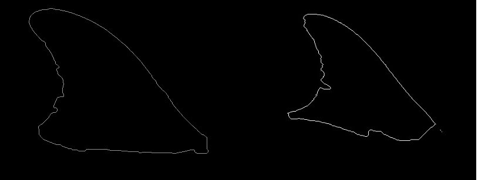
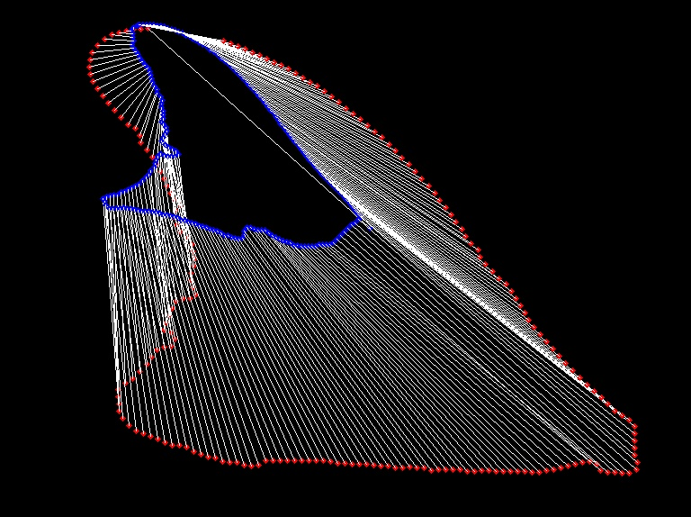
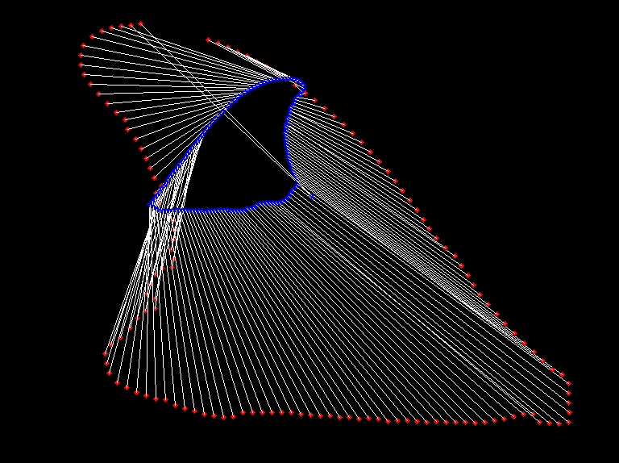

A small code to illustrate Shape Context Matching. The code implemented is mostly straightforward and can be followed in [here](http://www.cs.berkeley.edu/~malik/papers/BMP-shape.pdf). We use OpenCV libraries to do most I/O. I bin the points and use an auxiliary library to do the weighted bipartite matching. Rather than taking the contour points from the image, I take them from a file for convenience. However, I have also provided the two test images to compare with.

    make
    ./match <contour1_file> <contour2_file>

If you have installed OpenCV at a different location, depending on your bash configurations and ld configurations, you may have to add an additional few things in the Makefile. My compilation step would usually be

    g++ -I/opt/local/include main.cpp lap.cpp /opt/local/lib -lopencv_core -lopencv_imgproc -lopencv_highgui -o match
    ./match conts_015.out conts_008.out

---

 

Two distinct dorsal fins of dolphins. Segmented out (using graphcuts) and extracted the outline using some rudimentary thresholding measures.

---

 

Weighted Bipartite Matching is good at matching the contours. However, the process is slow and one needs to select a subset of the sample points. Choosing the right points is an issue I am looking into.

---

 

Bad results (obviously) for non-aligned fins. The problem is solved using registration. However, given the limited ways in which a camera can capture an image of the fin, maybe such heavy machinery may afterall not be required. Can we get away with a quick DFT and check the lines and angles in the frequency domain? Looking at it. Will update it here soon.

---

C++, OpenCV, Computer Vision
